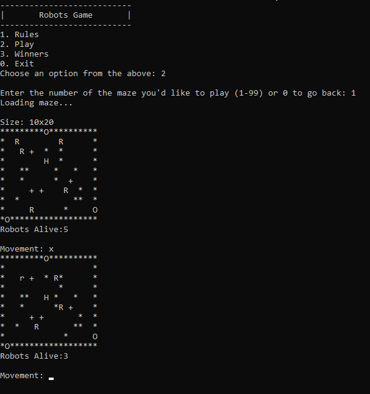

<!-- PROJECT LOGO -->
<br />
<div align="center">
  <h3 align="center">Robots Game (OOP)</h3>

  <p align="center">
    Robots game in C++, using OOP
    <br />
  </p>
</div>


<!-- TABLE OF CONTENTS -->
<details>
  <summary>Table of Contents</summary>
  <ol>
    <li>
      <a href="#about-the-project">About The Project</a>
      <ul>
        <li><a href="#built-with">Built With</a></li>
      </ul>
    </li>
    <li>
      <a href="#getting-started">Getting Started</a>
      <ul>
        <li><a href="#prerequisites">Prerequisites</a></li>
        <li><a href="#installation">Installation</a></li>
      </ul>
    </li>
    <li><a href="#usage">Usage</a></li>
    <li><a href="#acknowledgments">Acknowledgments</a></li>
    <li><a href="#project-grade">Project Grade</a></li>
  </ol>
</details>


<!-- ABOUT THE PROJECT -->
## About The Project

<div style="text-align: center;">
  
</div>

With the goal of learning the principles of object oriented programming (OOP), this project aimed to rebuild/refactor the CLI game from [TP1](../TP1/README.md)

### Built With

[![CPP][CPP]][CPP-url]

<!-- GETTING STARTED -->
## Getting Started

### Prerequisites

The following prerequisites must be met before being able to run the project:

* Any C++ compiler, in this case, [gcc](https://gcc.gnu.org/)

<!-- USAGE EXAMPLES -->
## Usage

In order to execute C++ files, they first have to be compiled.

### Compilation

In a terminal, run the following command inside the `src` directory to compile the program:

```sh
g++ -I ./include -o main ./*.cpp
```
This command links all the dependencies together into a single executable file.

### Execution

After compiling the program, all that's left is to run it with:
```sh
.\main
```

From this point onward, navigating the menus should require no explanation as they are pretty simple.


<!-- ACKNOWLEDGMENTS -->
## Acknowledgments

Group colleagues:
* [Ricardo Almeida Cavalheiro](https://github.com/RicardoCavalheiro123)


<!-- GRADE -->
### Project Grade

<div id="progress-container" style="border: 1px solid #ddd; border-radius: 5px; width: 200px; height: 20px; position: relative; background-color: #f3f3f3;">
    <div id="progress-bar" style="height: 100%; border-radius: 5px; display: flex; align-items: center;
        width: 85.00%;
        background-color: #97D655;
    ">
        <span id="progress-text" style="width: 100%; text-align: center; position: absolute; color: black;"> 17.0 / 20</span>
    </div>
</div>


<!-- MARKDOWN LINKS & IMAGES -->

[CPP]: https://img.shields.io/badge/-C%2B%2B-%23659BD3?style=for-the-badge&logo=data%3Aimage%2Fsvg%2Bxml%3Bbase64%2CPHN2ZyBmaWxsPSIjMDA1OTlDIiByb2xlPSJpbWciIHZpZXdCb3g9IjAgMCAyNCAyNCIgeG1sbnM9Imh0dHA6Ly93d3cudzMub3JnLzIwMDAvc3ZnIj48dGl0bGU%2BQysrPC90aXRsZT48cGF0aCBkPSJNMjIuMzk0IDZjLS4xNjctLjI5LS4zOTgtLjU0My0uNjUyLS42OUwxMi45MjYuMjJjLS41MDktLjI5NC0xLjM0LS4yOTQtMS44NDggMEwyLjI2IDUuMzFjLS41MDguMjkzLS45MjMgMS4wMTMtLjkyMyAxLjZ2MTAuMThjMCAuMjk0LjEwNC42Mi4yNzEuOTEuMTY3LjI5LjM5OC41NDMuNjUyLjY5bDguODE2IDUuMDljLjUwOC4yOTMgMS4zNC4yOTMgMS44NDggMGw4LjgxNi01LjA5Yy4yNTQtLjE0Ny40ODUtLjQuNjUyLS42OS4xNjctLjI5LjI3LS42MTYuMjctLjkxVjYuOTFjLjAwMy0uMjk0LS4xLS42Mi0uMjY4LS45MXpNMTIgMTkuMTFjLTMuOTIgMC03LjEwOS0zLjE5LTcuMTA5LTcuMTEgMC0zLjkyIDMuMTktNy4xMSA3LjExLTcuMTFhNy4xMzMgNy4xMzMgMCAwMTYuMTU2IDMuNTUzbC0zLjA3NiAxLjc4YTMuNTY3IDMuNTY3IDAgMDAtMy4wOC0xLjc4QTMuNTYgMy41NiAwIDAwOC40NDQgMTIgMy41NiAzLjU2IDAgMDAxMiAxNS41NTVhMy41NyAzLjU3IDAgMDAzLjA4LTEuNzc4bDMuMDc4IDEuNzhBNy4xMzUgNy4xMzUgMCAwMTEyIDE5LjExem03LjExLTYuNzE1aC0uNzl2Ljc5aC0uNzl2LS43OWgtLjc5di0uNzloLjc5di0uNzloLjc5di43OWguNzl6bTIuOTYyIDBoLS43OXYuNzloLS43OXYtLjc5aC0uNzl2LS43OWguNzl2LS43OWguNzl2Ljc5aC43OXoiLz48L3N2Zz4%3D

[CPP-url]: https://isocpp.org/

